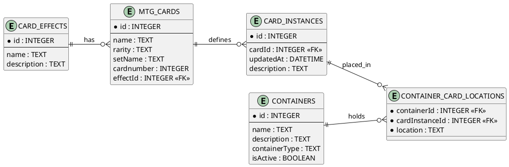

# ER 図（DB 概要 / PlantUML）

以下は現在の論理データモデルを表す ER 図です。PlantUML 対応環境で可視化できます。

```plantuml
@startuml
left to right direction

entity "CARD_EFFECTS" as card_effects {
  *id : INTEGER
  --
  name : TEXT
  description : TEXT
}

entity "MTG_CARDS" as mtg_cards {
  *id : INTEGER
  --
  name : TEXT
  rarity : TEXT
  setName : TEXT
  cardnumber : INTEGER
  effectId : INTEGER <<FK>>
}

entity "CARD_INSTANCES" as card_instances {
  *id : INTEGER
  --
  cardId : INTEGER <<FK>>
  updatedAt : DATETIME
  description : TEXT
}

entity "CONTAINERS" as containers {
  *id : INTEGER
  --
  name : TEXT
  description : TEXT
  containerType : TEXT
  isActive : BOOLEAN
}

entity "CONTAINER_CARD_LOCATIONS" as ccl {
  *containerId : INTEGER <<FK>>
  *cardInstanceId : INTEGER <<FK>>
  *location : TEXT
}

card_effects ||--o{ mtg_cards : has
mtg_cards    ||--o{ card_instances : defines
containers   ||--o{ ccl : holds
card_instances ||--o{ ccl : placed_in
@enduml
```
