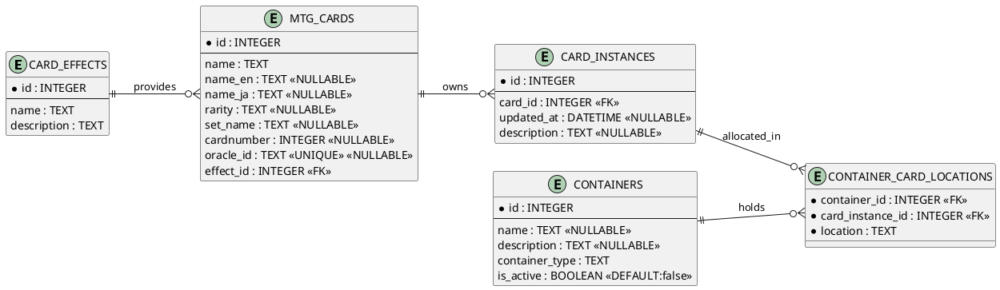

# ER 図（PlantUML）

カード管理アプリの Drift 実装（`lib/db`）のテーブル定義に合わせた ER 図です。PlantUML 対応環境で貼り付けると図として確認できます。

- `mtg_cards` は言語別のカード名、印刷情報、効果参照を保持します。`oracle_id` はユニーク制約付きの任意値です。
- `card_instances` は所持しているカード個体を表します。コンテナとの対応は中間表 `container_card_locations` で管理します。
- `containers` はデッキや整理用の入れ物を表し、`is_active` でアクティブなデッキを示します。
- `container_card_locations` は 1 枚のカード個体がどのコンテナのどの区分（main/side 等）にあるかを管理する複合主キーを持つ表です。

